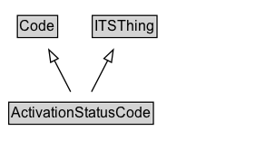

# ActivationStatusCode

A code indicating the activation status of an object

EXAMPLE: active, beingSetUp, beingShutDown, inactive, scheduled

## Diagram

=== "SVG (interactive)"

    <!-- Generated by graphviz version 14.1.3 (20260303.0454)
     -->
    <!-- Pages: 1 -->
    <svg width="219pt" height="132pt"
     viewBox="0.00 0.00 219.00 132.00" xmlns="http://www.w3.org/2000/svg" xmlns:xlink="http://www.w3.org/1999/xlink">
    <g id="graph0" class="graph" transform="scale(1 1) rotate(0) translate(4 128)">
    <polygon fill="white" stroke="none" points="-4,4 -4,-128 215,-128 215,4 -4,4"/>
    <g id="clust3" class="cluster">
    <title>cluster_associated</title>
    </g>
    <!-- Code -->
    <g id="node1" class="node">
    <title>Code</title>
    <g id="a_node1"><a xlink:href="../Code" xlink:title="&lt;TABLE&gt;">
    <polygon fill="lightgray" stroke="none" points="11.38,-97.88 11.38,-114.12 42.62,-114.12 42.62,-97.88 11.38,-97.88"/>
    <text xml:space="preserve" text-anchor="start" x="12.38" y="-101.88" font-family="Arial" font-size="12.00">Code</text>
    <polygon fill="none" stroke="black" points="10.38,-96.88 10.38,-115.12 43.62,-115.12 43.62,-96.88 10.38,-96.88"/>
    </a>
    </g>
    </g>
    <!-- ITSThing -->
    <g id="node2" class="node">
    <title>ITSThing</title>
    <g id="a_node2"><a xlink:href="../ITSThing" xlink:title="&lt;TABLE&gt;">
    <polygon fill="lightgray" stroke="none" points="73.25,-97.88 73.25,-114.12 124.75,-114.12 124.75,-97.88 73.25,-97.88"/>
    <text xml:space="preserve" text-anchor="start" x="74.25" y="-101.88" font-family="Arial" font-size="12.00">ITSThing</text>
    <polygon fill="none" stroke="black" points="72.25,-96.88 72.25,-115.12 125.75,-115.12 125.75,-96.88 72.25,-96.88"/>
    </a>
    </g>
    </g>
    <!-- ActivationStatusCode -->
    <g id="node3" class="node">
    <title>ActivationStatusCode</title>
    <g id="a_node3"><a xlink:href="../ActivationStatusCode" xlink:title="&lt;TABLE&gt;">
    <polygon fill="lightgray" stroke="none" points="4.25,-25.88 4.25,-42.12 121.75,-42.12 121.75,-25.88 4.25,-25.88"/>
    <text xml:space="preserve" text-anchor="start" x="5.25" y="-29.88" font-family="Arial" font-size="12.00">ActivationStatusCode</text>
    <polygon fill="none" stroke="black" points="3.25,-24.88 3.25,-43.12 122.75,-43.12 122.75,-24.88 3.25,-24.88"/>
    </a>
    </g>
    </g>
    <!-- ActivationStatusCode&#45;&gt;Code -->
    <g id="edge1" class="edge">
    <title>ActivationStatusCode&#45;&gt;Code</title>
    <path fill="none" stroke="black" d="M54.37,-51.79C50.35,-59.59 45.48,-69.07 40.96,-77.85"/>
    <polygon fill="none" stroke="black" points="37.87,-76.22 36.41,-86.71 44.09,-79.42 37.87,-76.22"/>
    </g>
    <!-- ActivationStatusCode&#45;&gt;ITSThing -->
    <g id="edge2" class="edge">
    <title>ActivationStatusCode&#45;&gt;ITSThing</title>
    <path fill="none" stroke="black" d="M71.63,-51.79C75.65,-59.59 80.52,-69.07 85.04,-77.85"/>
    <polygon fill="none" stroke="black" points="81.91,-79.42 89.59,-86.71 88.13,-76.22 81.91,-79.42"/>
    </g>
    <!-- Invis -->
    </g>
    </svg>

=== "PNG"

    

## Formalization for ActivationStatusCode

| Property | Constraint |
|----------|------------|
| subClassOf | [ITSThing](ITSThing.md) |
| subClassOf | [Code](Code.md) |

