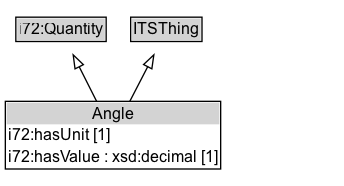

# Angle

An angle defined by two lines.

## Diagram

=== "SVG (interactive)"

    <!-- Generated by graphviz version 14.1.3 (20260303.0454)
     -->
    <!-- Pages: 1 -->
    <svg width="258pt" height="139pt"
     viewBox="0.00 0.00 258.00 139.00" xmlns="http://www.w3.org/2000/svg" xmlns:xlink="http://www.w3.org/1999/xlink">
    <g id="graph0" class="graph" transform="scale(1 1) rotate(0) translate(4 135.38)">
    <polygon fill="white" stroke="none" points="-4,4 -4,-135.38 253.75,-135.38 253.75,4 -4,4"/>
    <g id="clust3" class="cluster">
    <title>cluster_associated</title>
    </g>
    <!-- i72_Quantity -->
    <g id="node1" class="node">
    <title>i72_Quantity</title>
    <g id="a_node1"><a xlink:href="https://w3id.org/itsdata/i72/v1/Quantity" xlink:title="&lt;TABLE&gt;">
    <polygon fill="lightgray" stroke="none" points="8.88,-105.25 8.88,-121.5 74.62,-121.5 74.62,-105.25 8.88,-105.25"/>
    <text xml:space="preserve" text-anchor="start" x="9.88" y="-109.25" font-family="Arial" font-size="12.00">i72:Quantity</text>
    <polygon fill="none" stroke="black" points="7.88,-104.25 7.88,-122.5 75.62,-122.5 75.62,-104.25 7.88,-104.25"/>
    </a>
    </g>
    </g>
    <!-- ITSThing -->
    <g id="node2" class="node">
    <title>ITSThing</title>
    <g id="a_node2"><a xlink:href="../ITSThing" xlink:title="&lt;TABLE&gt;">
    <polygon fill="lightgray" stroke="none" points="95,-105.25 95,-121.5 146.5,-121.5 146.5,-105.25 95,-105.25"/>
    <text xml:space="preserve" text-anchor="start" x="96" y="-109.25" font-family="Arial" font-size="12.00">ITSThing</text>
    <polygon fill="none" stroke="black" points="94,-104.25 94,-122.5 147.5,-122.5 147.5,-104.25 94,-104.25"/>
    </a>
    </g>
    </g>
    <!-- Angle -->
    <g id="node3" class="node">
    <title>Angle</title>
    <g id="a_node3"><a xlink:href="../Angle" xlink:title="&lt;TABLE&gt;">
    <polygon fill="lightgray" stroke="none" points="1,-42.12 1,-58.38 160.5,-58.38 160.5,-42.12 1,-42.12"/>
    <text xml:space="preserve" text-anchor="start" x="65" y="-46.12" font-family="Arial" font-size="12.00">Angle</text>
    <text xml:space="preserve" text-anchor="start" x="2" y="-29.88" font-family="Arial" font-size="12.00">i72:hasUnit [1]</text>
    <text xml:space="preserve" text-anchor="start" x="2" y="-13.62" font-family="Arial" font-size="12.00">i72:hasValue : xsd:decimal [1]</text>
    <polygon fill="none" stroke="black" points="0,-8.62 0,-59.38 161.5,-59.38 161.5,-8.62 0,-8.62"/>
    </a>
    </g>
    </g>
    <!-- Angle&#45;&gt;i72_Quantity -->
    <g id="edge1" class="edge">
    <title>Angle&#45;&gt;i72_Quantity</title>
    <path fill="none" stroke="black" d="M68.6,-59.1C64.41,-67.42 59.68,-76.81 55.37,-85.35"/>
    <polygon fill="none" stroke="black" points="52.27,-83.73 50.89,-94.23 58.52,-86.88 52.27,-83.73"/>
    </g>
    <!-- Angle&#45;&gt;ITSThing -->
    <g id="edge2" class="edge">
    <title>Angle&#45;&gt;ITSThing</title>
    <path fill="none" stroke="black" d="M93.21,-59.1C97.56,-67.52 102.47,-77.02 106.93,-85.64"/>
    <polygon fill="none" stroke="black" points="103.67,-86.97 111.38,-94.24 109.89,-83.75 103.67,-86.97"/>
    </g>
    <!-- Invis -->
    </g>
    </svg>

=== "PNG"

    

## Specializations of Angle

| Class | Description |
|-------|-------------|
| [Bearing](Bearing.md) | The orientation of a line or movement, measured from north (0°) clockwise. |

## Formalization for Angle

| Property | Constraint |
|----------|------------|
| [i72:hasUnit](https://w3id.org/itsdata/i72/v1/hasUnit) | exactly 1 [AngleUnit](https://w3id.org/itsdata/core/v1/AngleUnit) |
| [i72:hasValue](https://w3id.org/itsdata/i72/v1/hasValue) | exactly 1 xsd:decimal |
| [i72:value](https://w3id.org/itsdata/i72/v1/value) | only ComplexExpr and [i72:Measure](https://w3id.org/itsdata/i72/v1/Measure) |
| subClassOf | [ITSThing](ITSThing.md) |
| subClassOf | [i72:Quantity](https://w3id.org/itsdata/i72/v1/Quantity) |

