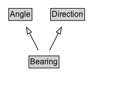

# Bearing

The orientation of a line or movement, measured from north (0°) clockwise.

EXAMPLE: 0°, 90°, 180°, 270°, 360°

## Diagram

=== "SVG (interactive)"

    <!-- Generated by graphviz version 14.1.3 (20260303.0454)
     -->
    <!-- Pages: 1 -->
    <svg width="186pt" height="132pt"
     viewBox="0.00 0.00 186.00 132.00" xmlns="http://www.w3.org/2000/svg" xmlns:xlink="http://www.w3.org/1999/xlink">
    <g id="graph0" class="graph" transform="scale(1 1) rotate(0) translate(4 128)">
    <polygon fill="white" stroke="none" points="-4,4 -4,-128 182,-128 182,4 -4,4"/>
    <g id="clust3" class="cluster">
    <title>cluster_associated</title>
    </g>
    <!-- Angle -->
    <g id="node1" class="node">
    <title>Angle</title>
    <g id="a_node1"><a xlink:href="../Angle" xlink:title="&lt;TABLE&gt;">
    <polygon fill="lightgray" stroke="none" points="10.25,-97.88 10.25,-114.12 43.75,-114.12 43.75,-97.88 10.25,-97.88"/>
    <text xml:space="preserve" text-anchor="start" x="11.25" y="-101.88" font-family="Arial" font-size="12.00">Angle</text>
    <polygon fill="none" stroke="black" points="9.25,-96.88 9.25,-115.12 44.75,-115.12 44.75,-96.88 9.25,-96.88"/>
    </a>
    </g>
    </g>
    <!-- Direction -->
    <g id="node2" class="node">
    <title>Direction</title>
    <g id="a_node2"><a xlink:href="../Direction" xlink:title="&lt;TABLE&gt;">
    <polygon fill="lightgray" stroke="none" points="74,-97.88 74,-114.12 124,-114.12 124,-97.88 74,-97.88"/>
    <text xml:space="preserve" text-anchor="start" x="75" y="-101.88" font-family="Arial" font-size="12.00">Direction</text>
    <polygon fill="none" stroke="black" points="73,-96.88 73,-115.12 125,-115.12 125,-96.88 73,-96.88"/>
    </a>
    </g>
    </g>
    <!-- Bearing -->
    <g id="node3" class="node">
    <title>Bearing</title>
    <g id="a_node3"><a xlink:href="../Bearing" xlink:title="&lt;TABLE&gt;">
    <polygon fill="lightgray" stroke="none" points="41,-25.88 41,-42.12 85,-42.12 85,-25.88 41,-25.88"/>
    <text xml:space="preserve" text-anchor="start" x="42" y="-29.88" font-family="Arial" font-size="12.00">Bearing</text>
    <polygon fill="none" stroke="black" points="40,-24.88 40,-43.12 86,-43.12 86,-24.88 40,-24.88"/>
    </a>
    </g>
    </g>
    <!-- Bearing&#45;&gt;Angle -->
    <g id="edge1" class="edge">
    <title>Bearing&#45;&gt;Angle</title>
    <path fill="none" stroke="black" d="M54.37,-51.79C50.35,-59.59 45.48,-69.07 40.96,-77.85"/>
    <polygon fill="none" stroke="black" points="37.87,-76.22 36.41,-86.71 44.09,-79.42 37.87,-76.22"/>
    </g>
    <!-- Bearing&#45;&gt;Direction -->
    <g id="edge2" class="edge">
    <title>Bearing&#45;&gt;Direction</title>
    <path fill="none" stroke="black" d="M71.63,-51.79C75.65,-59.59 80.52,-69.07 85.04,-77.85"/>
    <polygon fill="none" stroke="black" points="81.91,-79.42 89.59,-86.71 88.13,-76.22 81.91,-79.42"/>
    </g>
    <!-- Invis -->
    </g>
    </svg>

=== "PNG"

    

## Formalization for Bearing

| Property | Constraint |
|----------|------------|
| subClassOf | [Direction](Direction.md) |
| subClassOf | [Angle](Angle.md) |

