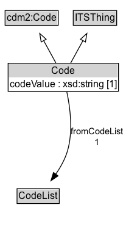

# Code

A code value whose meaning is defined by membership in (or reference to) a code list.

## Diagram

=== "SVG (interactive)"

    <!-- Generated by graphviz version 14.1.3 (20260303.0454)
     -->
    <!-- Pages: 1 -->
    <svg width="156pt" height="279pt"
     viewBox="0.00 0.00 156.00 279.00" xmlns="http://www.w3.org/2000/svg" xmlns:xlink="http://www.w3.org/1999/xlink">
    <g id="graph0" class="graph" transform="scale(1 1) rotate(0) translate(4 275)">
    <polygon fill="white" stroke="none" points="-4,4 -4,-275 151.62,-275 151.62,4 -4,4"/>
    <g id="clust3" class="cluster">
    <title>cluster_associated</title>
    </g>
    <!-- cdm2_Code -->
    <g id="node1" class="node">
    <title>cdm2_Code</title>
    <g id="a_node1"><a xlink:href="https://w3id.org/citydata/part2/v1/Code" xlink:title="&lt;TABLE&gt;">
    <polygon fill="lightgray" stroke="none" points="3.25,-244.88 3.25,-261.12 66.75,-261.12 66.75,-244.88 3.25,-244.88"/>
    <text xml:space="preserve" text-anchor="start" x="4.25" y="-248.88" font-family="Arial" font-size="12.00">cdm2:Code</text>
    <polygon fill="none" stroke="black" points="2.25,-243.88 2.25,-262.12 67.75,-262.12 67.75,-243.88 2.25,-243.88"/>
    </a>
    </g>
    </g>
    <!-- ITSThing -->
    <g id="node2" class="node">
    <title>ITSThing</title>
    <g id="a_node2"><a xlink:href="../ITSThing" xlink:title="&lt;TABLE&gt;">
    <polygon fill="lightgray" stroke="none" points="87.25,-244.88 87.25,-261.12 138.75,-261.12 138.75,-244.88 87.25,-244.88"/>
    <text xml:space="preserve" text-anchor="start" x="88.25" y="-248.88" font-family="Arial" font-size="12.00">ITSThing</text>
    <polygon fill="none" stroke="black" points="86.25,-243.88 86.25,-262.12 139.75,-262.12 139.75,-243.88 86.25,-243.88"/>
    </a>
    </g>
    </g>
    <!-- Code -->
    <g id="node3" class="node">
    <title>Code</title>
    <g id="a_node3"><a xlink:href="../Code" xlink:title="&lt;TABLE&gt;">
    <polygon fill="lightgray" stroke="none" points="7,-180 7,-196.25 141,-196.25 141,-180 7,-180"/>
    <text xml:space="preserve" text-anchor="start" x="59.38" y="-184" font-family="Arial" font-size="12.00">Code</text>
    <text xml:space="preserve" text-anchor="start" x="8" y="-167.75" font-family="Arial" font-size="12.00">codeValue : xsd:string [1]</text>
    <polygon fill="none" stroke="black" points="6,-162.75 6,-197.25 142,-197.25 142,-162.75 6,-162.75"/>
    </a>
    </g>
    </g>
    <!-- Code&#45;&gt;cdm2_Code -->
    <g id="edge1" class="edge">
    <title>Code&#45;&gt;cdm2_Code</title>
    <path fill="none" stroke="black" d="M64.82,-197.71C60.32,-205.91 54.78,-216 49.7,-225.24"/>
    <polygon fill="none" stroke="black" points="46.72,-223.4 44.97,-233.85 52.85,-226.77 46.72,-223.4"/>
    </g>
    <!-- Code&#45;&gt;ITSThing -->
    <g id="edge2" class="edge">
    <title>Code&#45;&gt;ITSThing</title>
    <path fill="none" stroke="black" d="M83.18,-197.71C87.68,-205.91 93.22,-216 98.3,-225.24"/>
    <polygon fill="none" stroke="black" points="95.15,-226.77 103.03,-233.85 101.28,-223.4 95.15,-226.77"/>
    </g>
    <!-- Invis -->
    <!-- Code&#45;&gt;Invis -->
    <!-- CodeList -->
    <g id="node5" class="node">
    <title>CodeList</title>
    <g id="a_node5"><a xlink:href="../CodeList" xlink:title="&lt;TABLE&gt;">
    <polygon fill="lightgray" stroke="none" points="18,-25.88 18,-42.12 68,-42.12 68,-25.88 18,-25.88"/>
    <text xml:space="preserve" text-anchor="start" x="19" y="-29.88" font-family="Arial" font-size="12.00">CodeList</text>
    <polygon fill="none" stroke="black" points="17,-24.88 17,-43.12 69,-43.12 69,-24.88 17,-24.88"/>
    </a>
    </g>
    </g>
    <!-- Code&#45;&gt;CodeList -->
    <g id="edge5" class="edge">
    <title>Code&#45;&gt;CodeList</title>
    <path fill="none" stroke="black" d="M78.35,-162C82.29,-143.59 86.44,-113.56 79,-89 76,-79.08 70.5,-69.31 64.7,-60.88"/>
    <polygon fill="black" stroke="black" points="67.53,-58.82 58.77,-52.86 61.9,-62.98 67.53,-58.82"/>
    <text xml:space="preserve" text-anchor="middle" x="115.37" y="-110.05" font-family="Arial" font-size="11.00">fromCodeList</text>
    <text xml:space="preserve" text-anchor="middle" x="115.37" y="-96.55" font-family="Arial" font-size="11.00">1</text>
    </g>
    <!-- Invis&#45;&gt;CodeList -->
    </g>
    </svg>

=== "PNG"

    

## Specializations of Code

| Class | Description |
|-------|-------------|
| [Activation Status Code](ActivationStatusCode.md) | A code indicating the activation status of an object |
| [Direction Code](DirectionCode.md) | A code representing orientation of a line or movement. |

## Formalization for Code

| Property | Constraint |
|----------|------------|
| [codeValue](../properties/codeValue.md) | exactly 1 xsd:string |
| [fromCodeList](../properties/fromCodeList.md) | exactly 1 [CodeList](https://w3id.org/itsdata/core/v1/CodeList) |
| subClassOf | [ITSThing](ITSThing.md) |
| subClassOf | [cdm2:Code](https://w3id.org/citydata/part2/v1/Code) |

