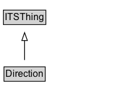

# Direction

The orientation of a line or movement.

## Diagram

=== "SVG (interactive)"

    <!-- Generated by graphviz version 14.1.3 (20260303.0454)
     -->
    <!-- Pages: 1 -->
    <svg width="150pt" height="132pt"
     viewBox="0.00 0.00 150.00 132.00" xmlns="http://www.w3.org/2000/svg" xmlns:xlink="http://www.w3.org/1999/xlink">
    <g id="graph0" class="graph" transform="scale(1 1) rotate(0) translate(4 128)">
    <polygon fill="white" stroke="none" points="-4,4 -4,-128 146,-128 146,4 -4,4"/>
    <g id="clust3" class="cluster">
    <title>cluster_associated</title>
    </g>
    <!-- ITSThing -->
    <g id="node1" class="node">
    <title>ITSThing</title>
    <g id="a_node1"><a xlink:href="../ITSThing" xlink:title="&lt;TABLE&gt;">
    <polygon fill="lightgray" stroke="none" points="1.25,-97.88 1.25,-114.12 52.75,-114.12 52.75,-97.88 1.25,-97.88"/>
    <text xml:space="preserve" text-anchor="start" x="2.25" y="-101.88" font-family="Arial" font-size="12.00">ITSThing</text>
    <polygon fill="none" stroke="black" points="0.25,-96.88 0.25,-115.12 53.75,-115.12 53.75,-96.88 0.25,-96.88"/>
    </a>
    </g>
    </g>
    <!-- Direction -->
    <g id="node2" class="node">
    <title>Direction</title>
    <g id="a_node2"><a xlink:href="../Direction" xlink:title="&lt;TABLE&gt;">
    <polygon fill="lightgray" stroke="none" points="2,-25.88 2,-42.12 52,-42.12 52,-25.88 2,-25.88"/>
    <text xml:space="preserve" text-anchor="start" x="3" y="-29.88" font-family="Arial" font-size="12.00">Direction</text>
    <polygon fill="none" stroke="black" points="1,-24.88 1,-43.12 53,-43.12 53,-24.88 1,-24.88"/>
    </a>
    </g>
    </g>
    <!-- Direction&#45;&gt;ITSThing -->
    <g id="edge1" class="edge">
    <title>Direction&#45;&gt;ITSThing</title>
    <path fill="none" stroke="black" d="M27,-51.79C27,-59.25 27,-68.24 27,-76.69"/>
    <polygon fill="none" stroke="black" points="23.5,-76.54 27,-86.54 30.5,-76.54 23.5,-76.54"/>
    </g>
    <!-- Invis -->
    </g>
    </svg>

=== "PNG"

    

## Specializations of Direction

| Class | Description |
|-------|-------------|
| [Bearing](Bearing.md) | The orientation of a line or movement, measured from north (0°) clockwise. |
| [Direction Code](DirectionCode.md) | A code representing orientation of a line or movement. |

## Formalization for Direction

| Property | Constraint |
|----------|------------|
| subClassOf | [ITSThing](ITSThing.md) |

